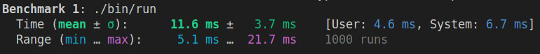
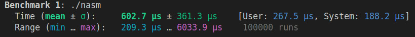

# Programming language (v2)

## Basic information

The [Programming language (v2)](https://github.com/lavrt/ProgrammingLanguage) project is a continuation of my [Programming language](https://github.com/lavrt/ProgrammingLanguage) project. In these works, I create a compiler for my own programming language, thereby deepening my knowledge in this field.

The difference between the new version of the project and the old one is the backend part of the compiler. In the previous version, AST generated code for its own assembly language, which was subsequently executed on a functional processor simulator. In the new project, the AST is generated into code in the NASM x86-64 language. I'm going to write simple programs to calculate the factorial of a number in both languages, and then compare the calculation speed for different implementations of my compiler.

## Theoretical information

Architecturally, the project consists of:
- Frontend: Lexer, parser, and code generator.
- Backend: Code generation for NASM.

Let's look at each part in more detail.

1. **Lexer**
The lexer breaks the source code into tokens, which are the minimum significant elements of the language (for example, keywords, identifiers, numbers, operators).

2. **Parser**
The parser builds an abstract syntax tree (AST) based on tokens, checking the grammar of the language.

3. **Code generator**
The code generator bypasses the AST and converts it into assembly code (NASM).

4. **Assembly into an executable file**
The resulting NASM code is assembled and linked:
```
nasm -f elf64 nasm.s -o nasm.o
gcc -no-pie nasm.o -o nasm
```

## Sample programs
Example of a program for calculating the factorial using the function:
```
def f ( n )
{
    k = 1 ;
    i = 0 ;
    while ( i < n )
    {
        i = i + 1 ;
        k = k * i ;
        if ( n == i )
        {
            return k ;
        } ;
    } ;
} ;
n = 20 ;
k = call f ( n ) ;
end
```

Example of a program for calculating the factorial without using the function:
```
n = 20 ;
k = 1 ;
i = 0 ;
while ( i < n )
{
    i = i + 1 ;
    k = k * i ;
    if ( n == i )
    {
        z = 0 ;
        z = k ;
    } ;
} ;
end
```

## Comparison of the calculation speed of the factorial for compilers with various backend modules

As already noted, we are comparing the first version of my project and the latest one. As a test program, we will use the calculation of the factorial of the number 20, the largest number whose factorial is placed in 64 bits (the code is given above). To get closer to the true value of the program execution speed, we will measure time by repeatedly repeating the same program. The hyperfine utility will help us with this.

### Programming language, (the first version, with a virtual machine)



1000 launches of the program were conducted. As a result, we get that the average calculation time of the factorial of the number 20 was __(11.6 ± 3.7) milliseconds__.

### Programming language v2, (the latest version, with nasm code generation)



1000 launches of the program were conducted. As a result, we get that the average calculation time of the factorial of the number 20 was __(602.7 ± 361.3) microseconds__.

### Performance Comparison
- version 1: __time_1 = (11.6 ± 3.7) milliseconds__
- version 2: __time_2 = (602.7 ± 361.3) microseconds__
- __time_1 / time_2 = 19.27__
The new version of the program in this test turned out to be __19.27 times faster__ on average than the previous version with its own virtual machine.

## Key Findings
##### 19.7x Speed Improvement:
VM version: 11.6 ms (± 3.7 ms)
NASM version: 602.7 µs (± 361.3 µs)

This represents a 19.7-fold performance increase in the NASM version.


## Conclusions
The results confirm that proper compiler development can lead to significant performance improvements.